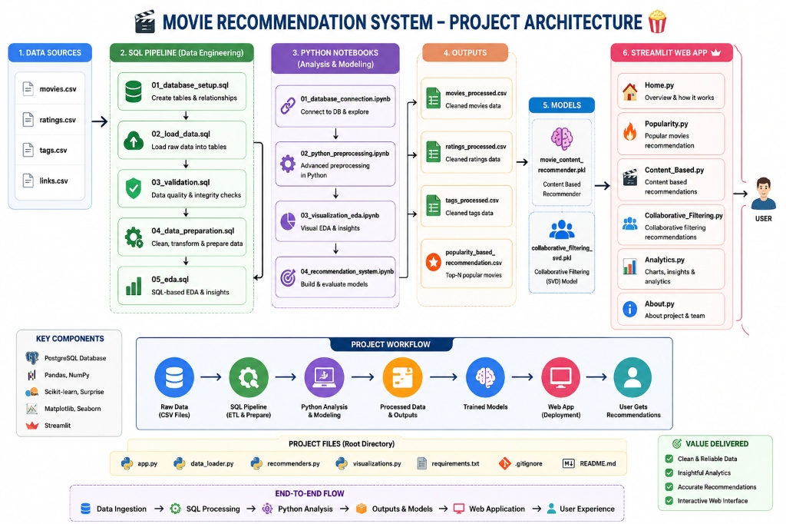

# 🎥 Smart Movie Recommender

An end-to-end Movie Recommendation System built using Machine Learning, SQL, PostgreSQL, and Streamlit.

Smart Movie Recommender combines multiple recommendation techniques to help users discover movies through popularity rankings, content similarity, and collaborative filtering. The project includes a complete data pipeline starting from raw MovieLens data, database processing, exploratory analysis, model development, and deployment through an interactive Streamlit web application.

---

## 🏗️ System Architecture

**Application:** [Open Smart Movie Recommender](https://smart-movie-recomendation.streamlit.app/)
=======
Below is the technical data flow and system architecture showing how the ETL pipelines, trained machine learning models, and Streamlit user interface components interact:



---

## 📌 Project Overview

This project was developed to explore recommendation systems and understand how large-scale movie recommendation platforms work.

The project covers:
* Database design and SQL querying
* Data cleaning and preprocessing
* Exploratory Data Analysis (EDA)
* Feature engineering
* Machine Learning model development
* Interactive dashboard creation
* Model deployment using Streamlit

The application allows users to:
* Browse top-rated movies
* Discover similar movies
* Receive personalized recommendations
* Explore dataset analytics
* Analyze rating trends and movie patterns

---

## 📊 Dataset

### MovieLens Dataset
Source: GroupLens Research
Dataset Characteristics:
* 83,000+ Movies
* 33,000,000+ Ratings
* 330,000+ Users
* Multiple decades of movie data

### Available Information
#### Movies
* Movie Title
* Release Year
* Genres

#### Ratings
* User ID
* Movie ID
* Rating (0.5 – 5.0)

#### Tags
* User-generated tags
* Movie descriptions

---

## 🧠 Recommendation Approaches

### 1. Popularity-Based Recommendation
#### Method
* Average rating ranking
* Review count weighting
* Statistical popularity scoring

#### Advantages
* Works for new users (solves cold-start)
* Easy to understand and implement
* Reliable baseline recommendations

#### Limitations
* No personalization
* Favors popular movies

---

### 2. Content-Based Filtering
#### Method
* TF-IDF Vectorization
* Cosine Similarity
* Metadata similarity matching

#### Features Used
* Genres
* Movie metadata
* Text-based attributes

#### Advantages
* No user history required
* Transparent recommendations (explainable results)
* Avoids popularity bias

#### Limitations
* Limited serendipity (recommends similar items)
* Dependent on available metadata quality

---

### 3. Collaborative Filtering
#### Method
* SVD Matrix Factorization
* Latent Factor Modeling
* User-Item Interaction Analysis

#### Advantages
* Highly personalized recommendations
* Learns hidden patterns (latent features)
* Discovers unexpected movies

#### Limitations
* Cold-start problem for new users/items
* Requires sufficient rating data to generalize

---

## 🛠 Technology Stack

### Programming Language
* Python 3.8+

### Data Analysis
* Pandas
* NumPy

### Machine Learning
* Scikit-Learn
* Surprise (scikit-surprise)

### Visualization
* Plotly
* Plotly Express

### Database
* PostgreSQL
* SQLAlchemy

### Dashboard
* Streamlit
* Custom CSS

### Development
* Jupyter Notebook
* Git

---

## 📂 Project Structure

```text
movie_recommendation_project/
│
├── 0.data/                          # Raw dataset folder
│   ├── movies.csv
│   ├── ratings.csv
│   ├── tags.csv
│   └── links.csv
│
├── 1.sql/                           # SQL scripts
│   ├── 01_database_setup.sql
│   ├── 02_load_data.sql
│   ├── 03_validation.sql
│   ├── 04_data_preparation.sql
│   └── 05_eda.sql
│
├── 2.notebook/                      # Jupyter notebooks
│   ├── 01_database_connection.ipynb
│   ├── 02_python_preprocessing.ipynb
│   ├── 03_visualization_eda.ipynb
│   └── 04_recommendation_system.ipynb
│
├── 3.outputs/                       # Processed database exports
│   ├── movies_processed.csv
│   ├── ratings_processed.csv
│   ├── tags_processed.csv
│   └── popularity_based_recommendation.csv
│
├── 4.models/                        # Pre-trained PKL models
│   ├── movie_content_recommender.pkl
│   └── collaborative_filtering_svd.pkl
│
├── 5.visualizations/                # Interactive HTML and PNG visual plots
│
├── app_pages/                       # Streamlit views
│   ├── Home.py
│   ├── Popularity.py
│   ├── Content_Based.py
│   ├── Collaborative_Filtering.py
│   ├── Analytics.py
│   └── About.py
│
├── app.py                           # Application main script
├── data_loader.py                   # Data caching utilities
├── recommenders.py                  # ML recommenders implementations
├── visualizations.py                # Rendering utilities
├── requirements.txt                 # Requirements
├── .gitignore                       # Git ignore list
└── README.md                        # Documentation
```

---

## 🚀 Installation & Run

Clone the repository:
```bash
git clone <repository-url>
cd movie_recommendation_project
```

Install dependencies:
```bash
pip install -r requirements.txt
```

Run the application:
```bash
streamlit run app.py
```

---

## 💡 Technical & Interview Deep-Dive Prep

This section details the design choices, mathematics, and performance configurations behind this system. Use it to prepare for discussions about the project's architecture and ML pipelines.

### 🧠 Recommendation Algorithms: Under the Hood

#### 1. Content-Based: TF-IDF and Cosine Similarity
To determine the similarity between two movies, we represent each movie's metadata (genres, titles, tags) as a text corpus. 
* **TF-IDF (Term Frequency-Inverse Document Frequency)** is used to convert the textual descriptions into a numerical feature space, assigning weights to terms based on how unique they are to a movie versus the entire catalog.
* **Cosine Similarity** measures the angle between these feature vectors in high-dimensional space:
  $$\text{Similarity}(A, B) = \cos(\theta) = \frac{A \cdot B}{\|A\| \|B\|}$$
* *Interview Question:* **Why Cosine Similarity over Euclidean Distance?**
  * *Answer:* Cosine similarity measures *orientation* rather than *magnitude*. If two movies have similar genre distributions but different tag counts (length of vector), Euclidean distance will penalize the length difference, whereas Cosine similarity focuses on the angle (genre distribution ratio), which represents content alignment.

#### 2. Collaborative Filtering: SVD Matrix Factorization
For personalized recommendation, we use **Singular Value Decomposition (SVD)** from the `Surprise` library. SVD factorizes the sparse User-Movie rating matrix $R$ into lower-dimensional user latent factors $P$ and movie latent factors $Q$:
$$\hat{r}_{u,i} = \mu + b_u + b_i + p_u^T q_i$$
Where $\mu$ is the global average rating, $b_u$ is user bias, $b_i$ is movie bias, and $p_u, q_i$ are the latent feature vectors for user $u$ and movie $i$. The model is trained using Stochastic Gradient Descent (SGD) minimizing squared error over known ratings.
* *Interview Question:* **How do you handle the Cold-Start problem?**
  * *Answer:* Collaborative filtering fails when a new user has no ratings (SVD cannot calculate $p_u$). In this system, we implement a fallback system: if the User ID is not found in the training ratings history, we route the user to popularity-based fallback lists (e.g. weighted highly-rated blockbusters) until they record rating profiles.

### 💾 SQL & ETL Pipeline Design
* **Database Setup:** Built PostgreSQL schemas and created composite indices on target foreign keys (`movieid`, `userid`) to accelerate large JOIN operations.
* **Validation Queries:** Formulated validation checks for duplicate entries, missing metadata (e.g. invalid release years), and null rating records to ensure model training datasets were cleaned and balanced.
* **Feature Engineering:** Staged and exported preprocessed datasets directly from SQL server storage to optimize downstream loading times.

### ⚡ Performance & Streamlit Optimization
* **Caching Mechanisms:** Used Streamlit's `@st.cache_data` for static tabular loading (CSV reading) and `@st.cache_resource` for pre-trained model loading (pkl files) to avoid redundant disk I/O on every user interaction rerun.
* **Memory Management:** Enabled sampling limits on huge datasets (e.g., loaded a subset of ratings records for visualizations) to prevent memory allocation faults in resource-constrained deployment environments.
